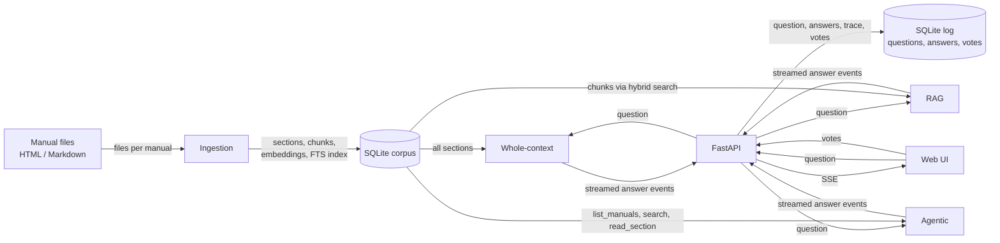

# Architecture overview

This demo answers one question three different ways, side by side, so you can see how each
retrieval strategy moves information from the manuals to the answer. This page is the map of the
code. Start with the picture, then read the units, then follow the two data flows.

## The big picture

Read it left to right. Manuals are loaded once into a SQLite database (ingestion). When someone asks
a question, FastAPI starts all three strategies at the same time, each reads from the same database
in its own way, and their answers stream back to the browser. Votes are saved in a second set of
tables, the log.

For the strategy-specific pictures see the "How it works" dialog in the app, or the documents in
`docs/strategies/`.

## The units

| Unit | What it does | File |
|------|--------------|------|
| Ingestion | Reads each manual folder, splits HTML or Markdown into sections, cuts sections into chunks, computes embeddings and writes everything to the corpus tables. | [`uma/corpus/ingest.py`](../../uma/corpus/ingest.py) |
| Corpus store | Reads and writes manuals, sections, chunks, embeddings, the FTS5 keyword index and the stored whole-context token count. | [`uma/corpus/store.py`](../../uma/corpus/store.py) |
| Hybrid search | Finds chunks by keywords (BM25) and by meaning (vector cosine), merges the two rankings with reciprocal rank fusion, and applies the coverage rule for RAG. | [`uma/search.py`](../../uma/search.py) |
| Embedder | Turns text into vectors locally, for chunks at ingestion and for the question at search time. | [`uma/embedding.py`](../../uma/embedding.py) |
| LLM wrapper | A thin layer over the Anthropic SDK (streaming, token counting) plus a `FakeLLM` used by tests. | [`uma/llm.py`](../../uma/llm.py) |
| Strategy base | The event types (text, trace step, final, failed), the shared answer rules, the status-tag filter and the citation helpers every strategy uses. | [`uma/strategies/base.py`](../../uma/strategies/base.py) |
| Whole-context | Puts every section of every manual into one prompt and lets Claude cite from it. | [`uma/strategies/whole_context.py`](../../uma/strategies/whole_context.py) |
| RAG | Retrieves the best chunks first, then asks Claude to answer from only those. | [`uma/strategies/rag.py`](../../uma/strategies/rag.py) |
| Agentic | Gives Claude tools to list, search and read, and lets it decide what to look at. | [`uma/strategies/agentic.py`](../../uma/strategies/agentic.py) |
| Runner | Runs the strategies in parallel, enforces the timeout, merges their events into one stream and saves each result. | [`uma/runner.py`](../../uma/runner.py) |
| Log | Stores questions, answers, metrics and votes. | [`uma/log.py`](../../uma/log.py) |
| Leaderboard | Aggregates votes into per-strategy results. | [`uma/leaderboard.py`](../../uma/leaderboard.py) |
| Web | The FastAPI routes, the Server-Sent Events stream and the static pages. | [`uma/web.py`](../../uma/web.py) |
| Static UI | Plain HTML, JavaScript and CSS, plus Mermaid for these diagrams. | [`uma/static/`](../../uma/static/) |

## Data flow 1: ingestion

Run with `uv run python -m uma ingest`.

1. Each folder under `manuals/` (or `sample_manuals/`) has a `manual.yaml` with the title, owner and
   base URL, plus the manual's HTML or Markdown files.
2. The parsers split each file at its headings. One heading becomes one **section** with an id, a
   heading path and its text.
3. Sections are cut into **chunks** of about 400 tokens, so retrieval works on small pieces.
4. The local embedder turns every chunk into a vector. Chunks, vectors and the FTS5 keyword index are
   written to SQLite. Re-running ingestion replaces the whole corpus.

No API key is needed: the whole-context token count is measured by Claude on the first
whole-context question and then stored in the database.

## Data flow 2: one question

1. The browser posts the question to `POST /api/questions`, which saves it and returns an id. The
   browser then opens `GET /api/questions/{id}/stream`, a Server-Sent Events connection.
2. The runner starts the three strategies at once. Each has a 90 second timeout, and a failure in one
   does not stop the others.
3. **Whole-context** sends all sections, grouped as one document per manual, with a cache marker
   after the last document. Claude cites the exact section blocks it used. The first question also
   measures and stores the token count, and writes the prompt cache. Later questions within the cache lifetime (about 5 minutes, refreshed on each hit) read the cache; after an idle gap the cache is written again.
4. **RAG** runs hybrid search (keyword plus vector, merged by RRF), applies the coverage rule so
   every relevant manual is represented, sends the retrieved chunks to the browser as a trace
   step, and only then calls Claude with those chunks as documents.
5. **Agentic** starts with just the question and three tools. Claude calls `list_manuals`, `search`
   and `read_section` for at most 8 tool calls (`AGENT_MAX_TOOL_CALLS`). When the budget is reached
   it is told to answer with what it has. Its answer names sections with `[§id]` markers, which the
   strategy turns into numbered `[n]` citations.
6. All three streams hide the trailing status tag (`answered`, `not_covered` or
   `contradiction_found`) from the visible text and report it separately.
7. Every event carries the strategy id, so the browser fills the right column. The runner saves each
   finished answer, its metrics and its trace to the log. Votes are posted later to `POST /api/votes`.

## Architecture decision records

Each decision behind this design is written up as an ADR. The [index](../adr/README.md) lists them all.

- [ADR 0001: Record architecture decisions](../adr/0001-record-architecture-decisions.md)
- [ADR 0002: Python with FastAPI for the backend](../adr/0002-python-fastapi-backend.md)
- [ADR 0003: Plain HTML, CSS and vanilla JavaScript frontend](../adr/0003-plain-html-vanilla-js-frontend.md)
- [ADR 0004: Server-Sent Events for streaming answers](../adr/0004-server-sent-events-for-streaming.md)
- [ADR 0005: SQLite for the corpus, question log and votes](../adr/0005-sqlite-for-corpus-log-and-votes.md)
- [ADR 0006: Same model, settings and answering rules for every strategy](../adr/0006-same-model-and-rules-for-all-strategies.md)
- [ADR 0007: Claude Opus 5.5 as the default model (superseded by 0011)](../adr/0007-claude-model-selection.md)
- [ADR 0008: Local embeddings and SQLite FTS5 for RAG's hybrid search](../adr/0008-local-embeddings-and-fts5-for-rag.md)
- [ADR 0009: Answer status via a trailing tag in the answer text](../adr/0009-answer-status-tag-protocol.md)
- [ADR 0010: Mermaid for architecture and strategy diagrams](../adr/0010-mermaid-for-diagrams.md)
- [ADR 0011: Switch the default model to Claude Sonnet 5.5](../adr/0011-switch-default-model-to-sonnet-5-5.md)
- [ADR 0012: Citation mechanism per strategy](../adr/0012-citation-mechanism-per-strategy.md)
