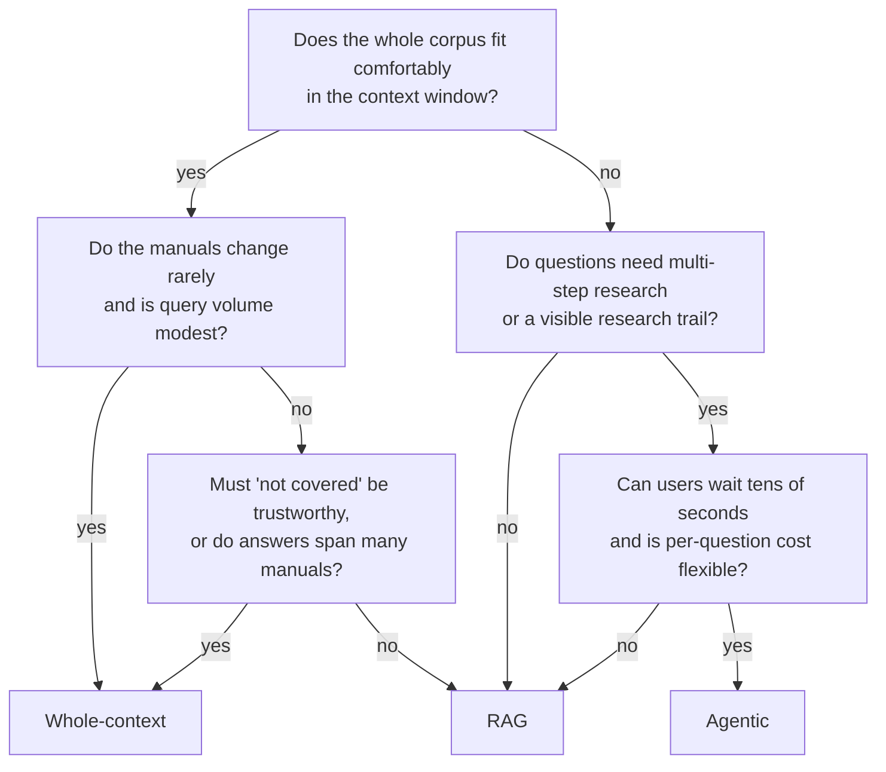

# Choosing a strategy

There is no best strategy, only a best fit for a corpus, a workload and a set of priorities. This
page compares the three side by side. Each strategy's own page explains how it works and goes into
more detail:

- [Whole-context](strategies/1-whole-context.md): send every manual, every time, and cache it.
- [RAG](strategies/2-rag.md): search first, then send only the best few chunks.
- [Agentic](strategies/3-agentic.md): give the model search and read tools and let it research.

## Decision matrix

Ratings: **good** means the strategy handles this well, **fair** means it works with caveats, and
**poor** means it's a reason to pick something else.

| Factor | Whole-context | RAG | Agentic |
|--------|---------------|-----|---------|
| **Corpus size** | **Poor beyond a few hundred thousand tokens.** Hard limit at the context window (this app stops at 800,000 tokens), and cost grows with size. | **Good.** The prompt is about 8 chunks whatever the corpus size. | **Good.** Reads only what it looks up; corpus size affects search, not the prompt. |
| **Change rate** (how often the manuals change) | **Poor for frequent changes.** Every change invalidates the cache, and the next call pays the full write price. | **Good.** Re-ingest changed manuals; nothing else to warm up. | **Good.** Same search index as RAG; no cache to invalidate. |
| **Query volume** | **Fair.** Fine while the cache stays warm (a hit every ~5 minutes); expensive per question at scale. | **Good.** Small, constant cost per question. | **Poor.** Several model calls per question multiply the cost. |
| **Cross-document need** | **Good.** Sees every manual at once and can merge steps from all of them. | **Fair.** Limited to top 8 chunks plus one coverage chunk per missing manual. | **Good.** Can follow references from one manual to another, within its 8-call budget. |
| **Honesty need** (trustworthy "not covered") | **Good.** "Not covered" is a judgement over the whole corpus. | **Poor.** "Not retrieved" looks the same as "not there". | **Fair.** It searches before giving up, but it can stop too early. |
| **Latency budget** | **Fair.** Fast on cache hits; slow on cold calls over a large corpus. | **Good.** One local search and one small model call. | **Poor.** One model call per turn, run one after another. |
| **Cost budget** | **Fair.** Cheap when cached and small; about $1.25 per cold call at 500,000 tokens. | **Good.** Lowest and most predictable at any scale. | **Poor.** Varies with the number of turns; the budget caps only the worst case. |
| **Transparency** (can you see why it answered that way?) | **Fair.** Citations show what it used, but not what it skipped. | **Good.** The retrieval trace shows exactly what the model was given. | **Good.** The trace shows every search and every section read, in order. |

All three use the same model, effort and answering rules
([ADR 0006](adr/0006-same-model-and-rules-for-all-strategies.md)), so the differences above come
from how each strategy chooses content, not from prompt tuning.

## Decision flowchart

A quick path through the main questions. Treat it as a starting point; the matrix above has the
reasons.

## Mixing strategies

Real systems often combine them. A common pattern is to route by question type: RAG for simple
lookups, an agent for questions that RAG answers poorly or reports as not covered. Another is to
use whole-context on a small, stable core (a quick start guide, a safety section) and RAG over the
long tail. This demo keeps the three separate on purpose, so you can see each one's strengths and
weaknesses on its own. The [demo questions](demo-questions.md) are chosen to bring those out.
