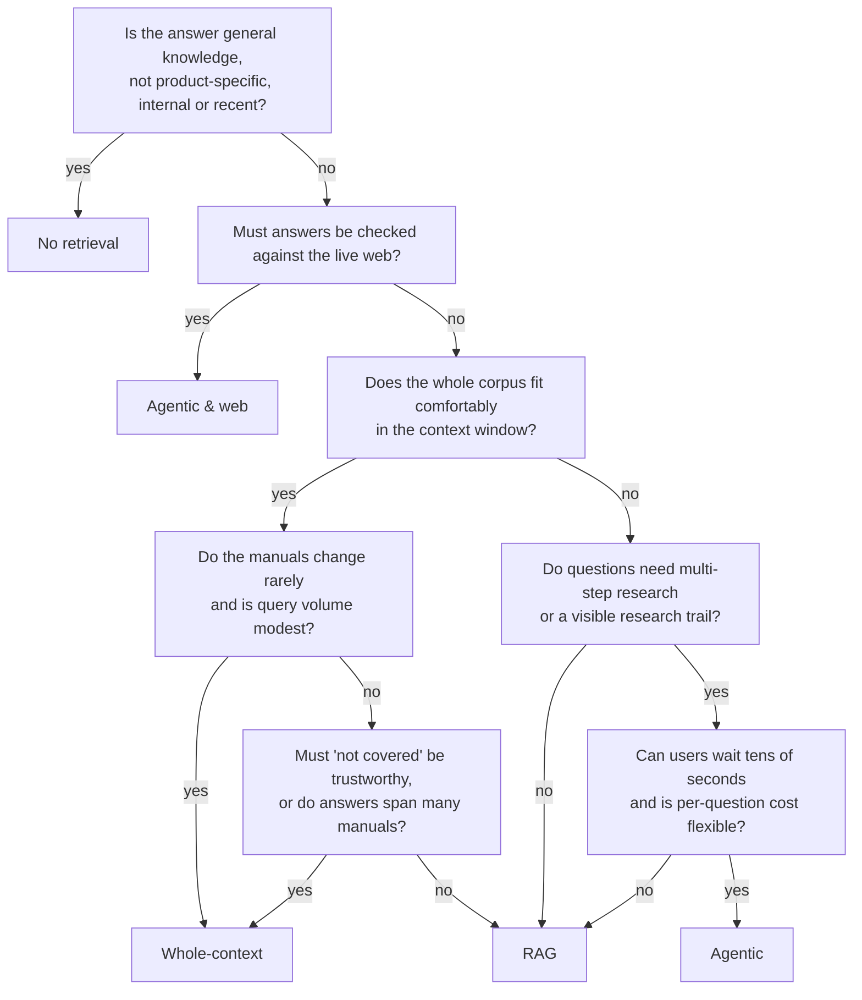

# Choosing a strategy

There is no best strategy, only a best fit for a corpus, a workload and a set of priorities. This
page compares the three manuals-only retrieval strategies side by side, together with the
no-retrieval baseline they are measured against and the Agentic & web strategy, which also checks
the web. Each strategy's own page explains how it works and goes into more detail:

- [No retrieval](strategies/0-baseline.md): send only the question; the control group that shows
  what the model knows on its own.
- [Whole-context](strategies/1-whole-context.md): send every manual, every time, and cache it.
- [RAG](strategies/2-rag.md): search first, then send only the best few chunks.
- [Agentic](strategies/3-agentic.md): give the model search and read tools and let it research.
- [Agentic & web](strategies/4-agentic-web.md): research the manuals, then the web, and merge both
  into one answer that flags where the manual may be out of date.

## Decision matrix

Ratings: **good** means the strategy handles this well, **fair** means it works with caveats, and
**poor** means it's a reason to pick something else.

| Factor | No retrieval | Whole-context | RAG | Agentic | Agentic & web |
|--------|--------------|---------------|-----|---------|---------------|
| **Corpus size** | **Good, but beside the point.** The corpus is never read, so neither its size nor its content matters. | **Poor beyond a few hundred thousand tokens.** Hard limit at the context window (this app stops at 800,000 tokens), and cost grows with size. | **Good.** The prompt is about 8 chunks whatever the corpus size. | **Good.** Reads only what it looks up; corpus size affects search, not the prompt. | **Good.** Same manual tools as Agentic; the web phase doesn't depend on the corpus. |
| **Change rate** (how often the manuals change) | **Poor.** It never sees the manuals, so changes, like the manuals themselves, are invisible to it. | **Poor for frequent changes.** Every change invalidates the cache, and the next call pays the full write price. | **Good.** Re-ingest changed manuals; nothing else to warm up. | **Good.** Same search index as RAG; no cache to invalidate. | **Good,** and it can notice when the manuals have *not* kept up: the web phase checks versions, settings and procedures that may have changed. |
| **Query volume** | **Good.** The cheapest call per question: only the question and the answer are billed. | **Fair.** Fine while the cache stays warm (a hit every ~5 minutes); expensive per question at scale. | **Good.** Small, constant cost per question. | **Poor.** Several model calls per question multiply the cost. | **Poor.** Three phases, about ten model requests and $0.01 per web search, for every question. |
| **Cross-document need** | **Poor.** There are no documents to combine. | **Good.** Sees every manual at once and can merge steps from all of them. | **Fair.** Limited to top 8 chunks plus one coverage chunk per missing manual. | **Good.** Can follow references from one manual to another, within its 8-call budget. | **Good.** Like Agentic, plus web pages for what the manuals don't cover. |
| **Honesty need** (trustworthy "not covered") | **Poor.** "Not covered" is the model's judgement of its own knowledge, and it can hallucinate confidently. | **Good.** "Not covered" is a judgement over the whole corpus. | **Poor.** "Not retrieved" looks the same as "not there". | **Fair.** It searches before giving up, but it can stop too early. | **Fair, but good on staleness.** Gaps are filled from the web and labelled as such rather than reported as `not_covered`; it is the only column that can flag a manual as out of date, though web results can create false conflicts. |
| **Latency budget** | **Good.** One small call, no search: the fastest column. | **Fair.** Fast on cache hits; slow on cold calls over a large corpus. | **Good.** One local search and one small model call. | **Poor.** One model call per turn, run one after another. | **Poor.** The slowest column: three phases in sequence, roughly 40–70 seconds, with no answer text until the merge. |
| **Cost budget** | **Good.** The cost floor: about $0.006 per question in the [worked example](strategies/0-baseline.md#cost-and-latency). | **Fair.** Cheap when cached and small; about $1.25 per cold call at 500,000 tokens. | **Good.** Small and predictable at any scale; the cheapest once the corpus passes a few tens of thousands of tokens or the whole-context cache is cold. | **Poor.** Varies with the number of turns; the budget caps only the worst case. | **Poor.** The most expensive column: about $0.13 per question in the [worked example](strategies/4-agentic-web.md#cost-and-latency), about four times Agentic. |
| **Transparency** (can you see why it answered that way?) | **Poor.** No citations and no trace; nothing to check the answer against. | **Fair.** Citations show what it used, but not what it skipped. | **Good.** The retrieval trace shows exactly what the model was given. | **Good.** The trace shows every search and every section read, in order. | **Good.** The trace shows every manual tool call, every web query and each phase's planner verdict; citations are marked as manual or web. |
| **Source control** (answers only from approved content) | **Poor.** Answers come from the model's training data, which you don't control. | **Good.** Manuals only. | **Good.** Manuals only. | **Good.** Manuals only. | **Poor.** Web pages are part of the answer by design; they are cited, but not reviewed by you. |

Whole-context, RAG and Agentic use the same model, effort and answering rules
([ADR 0006](adr/0006-same-model-and-rules-for-all-strategies.md)), so the differences between them
come from how each strategy chooses content, not from prompt tuning. Agentic & web is the deliberate
exception: same model and effort, but its own prompts, web search and a longer timeout
([ADR 0014](adr/0014-agentic-web-strategy.md)), so compare it with Agentic to see what the web adds. The baseline uses the same model and
effort too, with its own short rules because it has no content to answer from or cite
([ADR 0013](adr/0013-no-retrieval-baseline-strategy.md)). It is rarely the right choice for a manual
assistant; its job here is to show what retrieval adds.

## Decision flowchart

A quick path through the main questions. The first one is there to show where the baseline sits;
for questions about your own manuals the answer is almost always "no". Answer "yes" to the second
only if web sources are allowed in your answers and the cost and latency are acceptable. Treat it as a starting point; the matrix above has the
reasons.

## Mixing strategies

Real systems often combine them. A common pattern is to route by question type: RAG for simple
lookups, an agent for questions that RAG answers poorly or reports as not covered. Another is to
use whole-context on a small, stable core (a quick start guide, a safety section) and RAG over the
long tail. [Agentic & web](strategies/4-agentic-web.md) fits a third pattern: users get answers
from a manuals-only strategy, while Agentic & web runs over common questions in the background and
collects its conflict blocks as a list of manual sections that may need updating. This demo keeps
the strategies separate on purpose, so you can see each one's strengths and
weaknesses on its own. The [demo questions](demo-questions.md) are chosen to bring those out.
