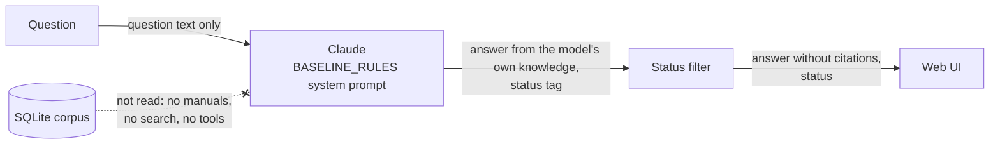
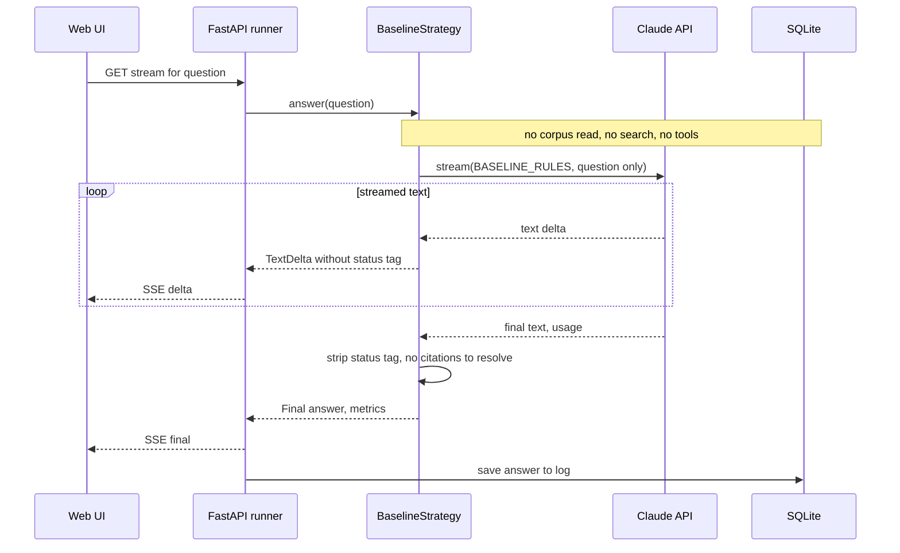

# Strategy 0: No retrieval (baseline)

The no-retrieval baseline is not a retrieval strategy at all: it is the **control group**. It sends
Claude only the question, with no manual content, no documents and no tools, so you can see what the
model knows on its own. Every other column is then a measurement of what retrieval adds on top of
that. See the [architecture overview](../architecture/overview.md) for how it fits into the app,
[choosing a strategy](../choosing-a-strategy.md) for a side-by-side comparison, and
[ADR 0013](../adr/0013-no-retrieval-baseline-strategy.md) for why it is built this way.

## In one paragraph

A large language model (LLM) learns from a huge amount of text up to a **training cutoff**, a date
after which it has seen nothing. Asked a question without any supporting text, it answers from what
it absorbed in training. For general questions ("what is Zigbee?", "why does a thermostat need a C
wire?") that is often good enough. For anything specific to *your* product, written in an internal
manual, or that happened after the cutoff, the model either doesn't know or, worse, produces a
fluent answer that sounds right and isn't: a **hallucination**. The baseline makes that visible. It
uses the same model, effort setting and server-side fallback as the other strategies; the only
difference is the system prompt. The shared answering rules say "answer only from the manual
content provided", which makes no sense when nothing is provided, so the baseline has its own short
rules: answer from your own knowledge, say plainly when you don't know or may be out of date, don't
invent dates, numbers or names, and end with the same status tag as every other strategy. There are
no citations, because there is nothing to cite.

## Diagrams

How data moves:

What happens in time order for one question:

The only database write is the runner saving the finished answer to the question log, the same as
for every strategy. The strategy itself never opens the corpus.

## Step by step

1. **Take the question, nothing else.** [`BaselineStrategy`](../../uma/strategies/baseline.py) is
   built with just the LLM wrapper and the settings. Unlike the other strategies it has no corpus
   store and no embedder, so it *cannot* read the manuals.
2. **Write the system prompt.** The system prompt is
   [`BASELINE_RULES`](../../uma/strategies/rules.py), used as is. It replaces the shared
   `ANSWERING_RULES` rather than adding to them: there is no "only from the manual content" rule and
   no citation rule. It keeps the three status values so the badge means the same thing in every
   column ([ADR 0009](../adr/0009-answer-status-tag-protocol.md)):
   - `answered` when the model can answer from its own knowledge;
   - `not_covered` when it doesn't know or can't answer reliably, including events after its
     training cutoff;
   - `contradiction_found` only if it knows of genuinely conflicting authoritative information.
3. **Call Claude once, streaming.** [`run_single_call`](../../uma/strategies/base.py) sends one user
   message whose content is the plain question text: no `document` blocks, no `tools`. The request
   goes through the same [`AnthropicLLM.stream`](../../uma/llm.py) as everyone else, so model,
   effort, adaptive thinking and the refusal fallback are identical
   ([ADR 0006](../adr/0006-same-model-and-rules-for-all-strategies.md),
   [ADR 0011](../adr/0011-switch-default-model-to-sonnet-5-5.md)). Text streams to the browser
   while the [`StatusTagFilter`](../../uma/strategies/base.py) hides the trailing status tag.
4. **No citations to resolve.** The strategy's `resolve` function always returns `None`, so the
   answer's citation list is empty and "manuals used" in the footer shows "—".
5. **Report the result.** A `Final` event carries the text, status and metrics. A refusal, an answer
   cut off at `max_tokens`, or an API error (for example a missing API key) becomes a `Failed` event,
   handled by `run_single_call` exactly as for whole-context and RAG.

## Prefer when

- **The question is general knowledge.** Definitions, common concepts, widely documented standards:
  "what is a heat pump?", "what does mesh Wi-Fi mean?". The model knows these well, and retrieval
  adds little.
- **You are establishing a baseline.** Before building retrieval for a new corpus, ask a sample of
  real user questions with no retrieval. If the baseline already answers most of them well, the
  corpus is mostly common knowledge and retrieval has less to prove.
- **You want to measure what retrieval adds.** Compare the baseline column with the others,
  question by question. Where the baseline says `not_covered` and a retrieval strategy answers with
  citations, retrieval earned its cost. Where both answer equally well, it didn't.

## Avoid when

- **The answer is product-specific.** The sample manuals describe a fictional product line, so the
  model has never seen the Nimbus thermostat's menus or the hub's Link button. It can only guess
  from similar real products.
- **The information is internal.** Anything that only exists in your organisation's documents was
  not in the training data.
- **The information is recent.** Anything after the training cutoff is unknown. Worse, the model
  may confidently describe the situation as it was at the cutoff, as if it were still current.
- **Users need to verify the answer.** There are no citations, so a reader cannot check where a claim
  came from, and a hallucinated detail looks exactly like a correct one.

## Cost and latency

Prices for the default model, Claude Sonnet 5.5, from
[ADR 0011](../adr/0011-switch-default-model-to-sonnet-5-5.md) and `PRICES` in
[`uma/config.py`](../../uma/config.py), in US dollars per million tokens (MTok): **$2.00 input,
$10.00 output.** Only the question and the answer are billed; there is no corpus in the prompt.

**Worked example.** Assumptions: `BASELINE_RULES` is about 720 characters, roughly 180 tokens
using the 4-characters-per-token rule, and a question is about 20 tokens, so call it 200 input
tokens. Assume about 600 output tokens: a short answer plus the model's adaptive thinking, which is
billed as output.

| Part | Tokens | Price | Cost |
|------|-------:|------:|-----:|
| Input (rules + question) | 200 | $2.00/MTok | $0.0004 |
| Output (answer + thinking) | 600 | $10.00/MTok | $0.0060 |
| **Total** | | | **≈ $0.0064** |

Two things stand out. First, **output dominates**: almost all of the cost is the answer itself, so
the baseline is roughly the floor that every strategy pays before any retrieval. Second, on the tiny
sample corpus the gap to the other strategies is smaller than you might expect: a warm whole-context
call there is about $0.009 (see the
[whole-context explainer](1-whole-context.md#cost-and-latency)). The gap grows with corpus size,
because the baseline's input never does. The prompt is also far too short to be cached, so the
cache-read and cache-write prices don't apply.

Latency is the lowest of the four columns: no search, no tool turns, and only a couple of hundred
input tokens to process before the first word. The extra cost of running the baseline alongside the
other strategies is one more small call per question.

## Typical failure modes

- **Confident hallucination.** The most important one to watch for. Asked "How do I pair the
  thermostat with the hub?", the model may describe a plausible generic procedure (hold a button,
  open an app, scan a code) with made-up button names. The rules tell it not to invent specifics,
  but it can still be wrong without knowing it.
- **Outdated answers.** Asked about something that changed after the training cutoff, the model may
  describe the old state of affairs. The rules ask it to flag this, and a good answer does, but it
  can't know *what* changed.
- **No citations.** Even a correct answer can't be verified from the app. The footer's "manuals
  used" is always empty.
- **Status is self-assessed.** `not_covered` here means "the model judged that it doesn't know",
  not "the manuals don't say". Models are not perfectly calibrated about the limits of their own
  knowledge, so an `answered` badge in this column is weaker evidence than in the others.

## What to look for in the demo

- **Product questions.** For the sample-corpus questions ("pair the thermostat with the hub",
  "what does error E3 mean?") expect a generic answer or a plain "I don't know about this specific
  product", with no citations. Compare it with the retrieval columns' specific, cited steps.
- **The contradiction question.** For the factory-reset question the baseline cannot see either
  manual, so it cannot report the 10-second versus 5-second contradiction. If it gives a number, it
  is a guess.
- **Recent news.** Ingest the Tesla FSD sample with
  `uv run python -m uma ingest --manuals-dir sample_manuals_for_UAT` and ask "List the European
  countries where I will be able to drive with Tesla FSD on 4-OCT-2026". Expect the baseline to say
  it doesn't know or that its information may be out of date (`not_covered`), while the retrieval
  strategies answer from the manual.
- **The cost and latency floor.** Compare the footer with the other columns: this is what an answer
  costs with no retrieval at all.
- **No trace.** Like whole-context, nothing appears between question and answer, but here it's
  because nothing was looked up.

The full list of showcase questions is in [demo questions](../demo-questions.md).
