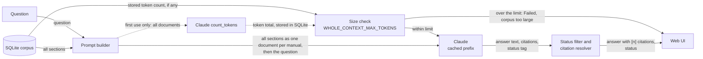
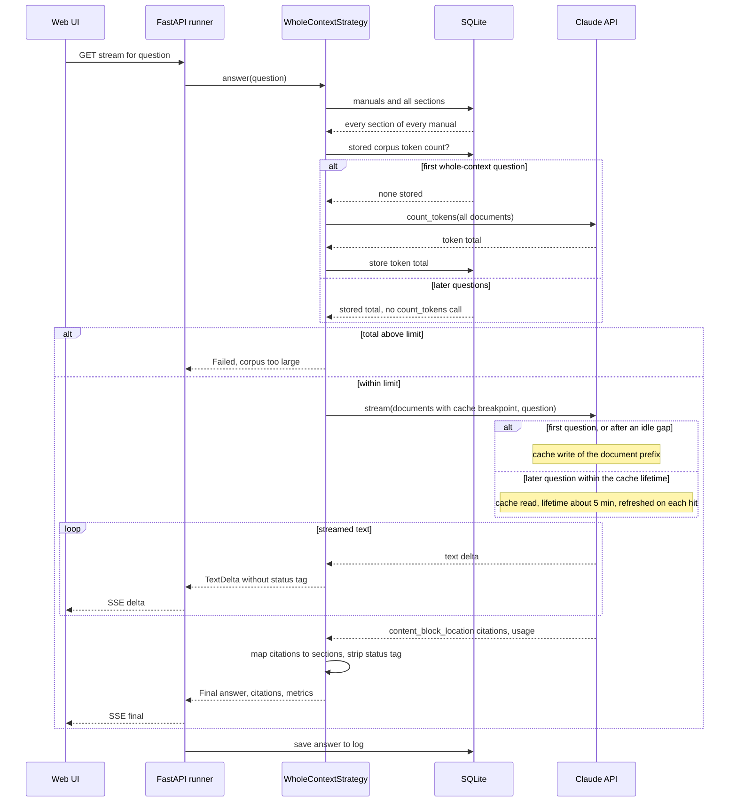

# Strategy 1: Whole-context

Whole-context is the simplest of the three strategies: no search, no tools. Every section of every
manual goes into the prompt, and Claude reads all of it before answering. It's the baseline the
other two strategies are measured against. See the [architecture overview](../architecture/overview.md)
for how it fits into the app, and [choosing a strategy](../choosing-a-strategy.md) for a side-by-side
comparison.

## In one paragraph

A large language model (LLM) can only use what is in its **context window**, the text sent with
the request. Claude Sonnet 5.5 has a 1-million-token window (a **token** is a piece of a word,
about 4 characters of English). If the manuals fit, the simplest thing is to send them all, every
time, and let the model find what matters. The app sends each manual as a citable **document
block**, so Claude's native citations feature can point at the exact section it used. Sending the
same large prefix over and over would be slow and expensive, so the request marks the end of the
documents with a **prompt cache** breakpoint: the first call stores the processed prefix on
Anthropic's servers, and later calls within about 5 minutes read it back at a tenth of the input
price. Because the model sees everything, it can combine steps from several manuals, spot two
manuals that disagree, and say with some confidence that a topic is *not* covered.

## Diagrams

How data moves:

What happens in time order for one question:

## Step by step

1. **Load the corpus.** `WholeContextStrategy.answer` reads every manual and every section from
   SQLite through the corpus store
   ([`answer`](../../uma/strategies/whole_context.py), [`CorpusStore.sections`](../../uma/corpus/store.py)).
2. **Build one document per manual.** [`build_documents`](../../uma/strategies/whole_context.py)
   turns each manual into a `document` block with `citations` enabled. Each section becomes one
   content block, headed by its heading path (for example
   `Thermostat settings and troubleshooting › Factory reset`). The last document gets
   `cache_control: {"type": "ephemeral"}`, the prompt-cache breakpoint.
3. **Check the size.** The strategy looks for a stored corpus token count
   ([`CorpusStore.corpus_token_count`](../../uma/corpus/store.py)). On the first whole-context
   question there is none, so it asks Claude to count the tokens of the full prompt
   ([`AnthropicLLM.count_tokens`](../../uma/llm.py)) and stores the total. If the total is above
   `WHOLE_CONTEXT_MAX_TOKENS` (800,000 by default, set in [`Settings`](../../uma/config.py)) it
   stops with a `Failed` event whose hint links to the [Avoid when](#avoid-when) section below.
4. **Write the system prompt.** The shared [`ANSWERING_RULES`](../../uma/strategies/rules.py)
   (the same for all three strategies, see [ADR 0006](../adr/0006-same-model-and-rules-for-all-strategies.md))
   plus one line describing the mechanism: "The complete manuals are provided as documents. Read
   them in full before answering."
5. **Call Claude once, streaming.** [`run_single_call`](../../uma/strategies/base.py) sends the
   documents followed by the question ([`AnthropicLLM.stream`](../../uma/llm.py)). Text streams to
   the browser as it arrives. The [`StatusTagFilter`](../../uma/strategies/base.py) holds back the
   trailing `<status>…</status>` tag so the reader never sees it
   ([ADR 0009](../adr/0009-answer-status-tag-protocol.md)).
6. **Turn citations into `[n]` markers.** Claude returns `content_block_location` citations: a
   document index and a block index. The strategy's `resolve` function maps them back to a manual
   and a section, and [`assemble_cited_text`](../../uma/strategies/base.py) numbers them `[1]`,
   `[2]`, … in the text. Each citation keeps the quoted passage (`cited_text`)
   ([ADR 0012](../adr/0012-citation-mechanism-per-strategy.md)).
7. **Report the result.** A `Final` event carries the answer text, citations, status and
   metrics (latency, token usage, cost, manuals used).

## Prefer when

- **The corpus fits comfortably in the context window**, up to roughly a few hundred thousand
  tokens. The three sample manuals are about 5,000 tokens, so they fit hundreds of times over.
- **Questions often span documents.** Pairing a thermostat with a hub needs steps from three
  manuals; whole-context sees all three at once without having to find them first.
- **Completeness and an honest "not covered" matter.** The model has read everything, so "the
  manuals don't mention Alexa" is a statement about the whole corpus, not about whatever a search
  happened to return.
- **The corpus changes rarely, so caching pays off.** The cached prefix stays valid until the
  manuals change, and a steady stream of questions keeps the cache warm.

## Avoid when

- **The corpus exceeds the context limit or grows unbounded.** This app refuses above 800,000
  tokens (`WHOLE_CONTEXT_MAX_TOKENS`) and you see "The manuals total N tokens, over the 800,000
  token limit for whole-context answering." There is no partial mode: switch to RAG or agentic, or
  trim the corpus.
- **High query volume with a frequently changing corpus.** Any change to the manuals changes the
  prefix, so the next call is a cache miss that re-bills every token at the cache-write price. The
  cache also expires after about 5 minutes without a hit, so bursty traffic pays for many writes.
- **Latency or cost per question must be minimal.** Even a cache read still sends the whole corpus
  through the model. Once the corpus is more than a few tens of thousands of tokens, or whenever the
  cache is cold, a RAG prompt of a few thousand tokens is cheaper and usually faster (see the
  break-even below).
- **Only a tiny slice is ever relevant.** If every question is a lookup such as "what does E3
  mean?", paying to send hundreds of pages to answer from one paragraph is waste.

## Cost and latency

Prices for the default model, Claude Sonnet 5.5, from
[ADR 0011](../adr/0011-switch-default-model-to-sonnet-5-5.md) and `PRICES` in
[`uma/config.py`](../../uma/config.py), in US dollars per million tokens (MTok):

| Input | Output | Cache read | Cache write |
|------:|-------:|-----------:|------------:|
| $2.00 | $10.00 | $0.20 | $2.50 |

**Worked example on the sample corpus.** Assumptions: the 49 sample sections total about 19,200
characters, measured with a short script that ingests `sample_manuals/`, which is about 4,800
tokens using the 4-characters-per-token rule. With the system prompt and document framing, call it
5,500 input tokens. Assume about 800 output tokens: a short answer plus the model's adaptive
thinking, which is billed as output.

| Call | Input side | Output | Total |
|------|-----------|--------|------:|
| First question (cache write) | 5,500 × $2.50/MTok = $0.0138 | 800 × $10/MTok = $0.0080 | ≈ $0.022 |
| Next question within ~5 min (cache read) | 5,500 × $0.20/MTok = $0.0011 | $0.0080 | ≈ $0.009 |

**The same arithmetic for a 500,000-token corpus** shows why caching and corpus size dominate:
the first call costs about 500,000 × $2.50/MTok = $1.25 for input alone, and a cached call about
$0.10. Without caching, every question would cost about $1.00 of input.

**Break-even with RAG.** A cache read costs a tenth of the normal input price ($0.20 versus $2.00
per MTok), so a *warm* whole-context call has cheaper input than a RAG call until the corpus is
about ten times the size of the RAG prompt. RAG sends roughly 8 chunks of up to 400 tokens plus
overhead, about 3,750 tokens on real manuals:

- RAG input: 3,750 × $2.00/MTok ≈ $0.0075 (≈ $0.0094 if billed at the $2.50 cache-write rate, see
  the [RAG explainer](2-rag.md#cost-and-latency));
- warm whole-context input for a corpus of C tokens: C × $0.20/MTok;
- equal when C ≈ 3,750 × 10 ≈ 37,500 tokens (≈ 47,000 at the cache-write rate).

Below that size, a warm whole-context call can cost the same as or less than RAG. On the sample
corpus (≈ 5,500 tokens) the warm input is about $0.0011, cheaper than RAG's input. Above it, or
whenever the cache is cold (first question, after re-ingesting, after 5 idle minutes), RAG is
cheaper, and the gap widens with every extra token in the corpus.

Latency follows the same shape: the model has to process every input token before it writes the
first word. On the sample corpus that's barely noticeable; on hundreds of thousands of tokens a
cold call can take tens of seconds, and a cache hit is much faster. The runner gives every
strategy 90 seconds (`STRATEGY_TIMEOUT_S`). The first question also makes one extra
`count_tokens` call; the result is stored, so later questions skip it.

**Reading the metrics footer.** Under each answer the app shows
`latency · input/output tok · cost · manuals used`. Two things to know:

- The *input* number counts only uncached input tokens. On a cache hit it can be tiny even though
  the whole corpus was used; the cached tokens are not in the footer, but they are in the cost.
- The cost is computed from all four token counts with `cost_usd` in
  [`uma/config.py`](../../uma/config.py), so it is the honest number to compare.

## Typical failure modes

- **The context limit.** Above 800,000 tokens the strategy refuses outright. Below it, but close,
  every call is slow and expensive.
- **Slow and expensive first calls.** The first question after start-up, after re-ingesting, or
  after more than about 5 idle minutes pays the full cache-write price and the full processing time.
  In the demo this is the question where whole-context is clearly the slowest column.
- **Lost in the middle.** On very long contexts, models are known to pay less attention to material
  buried in the middle than to the start and end. A detail in manual 37 of 60 can be overlooked even
  though it was "in the prompt". On the small sample corpus you won't see this; on a large real
  corpus, watch for answers that miss a section you know exists.
- **No sense of relevance ranking.** The model sees an old troubleshooting page and the current
  setup guide with equal weight. If manuals disagree, it should report a contradiction (that's the
  rule), but it can't know which manual is newer unless the text says so.

## What to look for in the demo

- **The first question versus the second.** Ask two questions within a few minutes and compare the
  latency and cost in the footer. The second should be noticeably cheaper because of the cache read.
- **Cross-manual pairing.** For "How do I pair the thermostat with the hub?" expect one ordered
  list that combines the hub's Link button, the thermostat's **Connect > Hub** menu and the app's
  code confirmation, with citations into all three manuals.
- **Honest gaps.** For "How do I control the thermostat with Alexa?" expect the `not_covered` badge.
- **Contradictions.** For the factory-reset question expect `contradiction_found`, with the
  thermostat manual's 10 seconds and the app help's 5 seconds both cited.
- **Citations.** Hover a `[n]` marker to see the manual and heading path; click it to open the
  full section in the side panel. Behind the scenes, whole-context citations also carry the exact
  quoted passage (`cited_text`), which is saved with the answer in the log.
- **No trace.** There is nothing to show between question and answer: no retrieval, no tool calls.
  That absence is the point of this strategy.

The full list of showcase questions is in [demo questions](../demo-questions.md).
