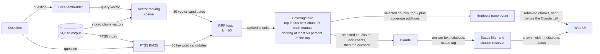
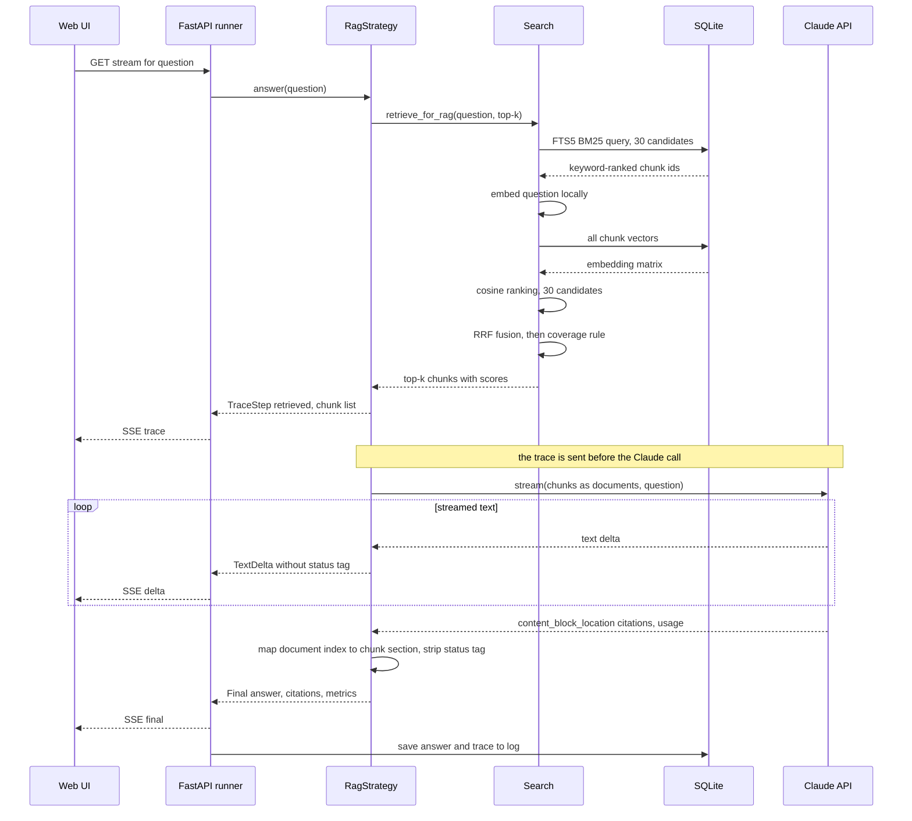

# Strategy 2: RAG (retrieval-augmented generation)

RAG is the most common way to build a question-answering system over documents. Code, not the
model, decides what the model gets to read: a search step picks a handful of passages, and only
those go into the prompt. See the [architecture overview](../architecture/overview.md) for how it
fits into the app, and [choosing a strategy](../choosing-a-strategy.md) for a side-by-side
comparison.

## In one paragraph

**Retrieval-augmented generation (RAG)** means: first *retrieve* the passages most likely to
answer the question, then let the model *generate* an answer from only those passages. At
ingestion time the manuals are cut into **chunks** of about 400 tokens (a token is about 4
characters of English), and each chunk is turned into an **embedding**, a list of numbers that
places text with similar meaning close together. At question time this app runs two searches and
merges them (**hybrid search**): **BM25**, a classic keyword-ranking formula that rewards rare
words appearing in a chunk (great for exact terms such as "E3"), and **vector search**, which
compares the question's embedding with every chunk's embedding (great for paraphrases such as
"restore defaults" for "factory reset"). The two ranked lists are combined with **reciprocal rank
fusion (RRF)**, which scores each chunk by its positions in both lists. The top 8 chunks, plus a
coverage rule that tops up any manual left out, go to Claude as citable documents. The prompt stays
small and its size doesn't depend on how big the corpus is, so RAG is cheap and predictable. The
price is that the model can only answer from what the search found.

## Diagrams

How data moves:

What happens in time order for one question:

## Step by step

1. **At ingestion: chunk and embed.** [`chunk_sections`](../../uma/corpus/chunking.py) cuts each
   section into chunks of at most 400 tokens (1,600 characters), splitting at paragraph breaks and
   repeating the last paragraph at the start of the next chunk. The local embedder
   ([`FastEmbedEmbedder`](../../uma/embedding.py), model `BAAI/bge-small-en-v1.5`) turns every chunk into
   a vector, and the chunks go into the SQLite FTS5 keyword index too
   ([ADR 0008](../adr/0008-local-embeddings-and-fts5-for-rag.md)).
2. **Retrieve.** `RagStrategy.answer` ([`answer`](../../uma/strategies/rag.py)) calls
   [`retrieve_for_rag`](../../uma/search.py) with `RAG_TOP_K` (8 by default).
3. **Keyword ranking.** Inside [`hybrid_search`](../../uma/search.py), FTS5 ranks chunks with BM25
   and keeps the best 30 ([`CorpusStore.fts_search`](../../uma/corpus/store.py)).
4. **Vector ranking.** [`_vector_ranking`](../../uma/search.py) embeds the question locally,
   multiplies it with the stored embedding matrix (cosine similarity, because the vectors are
   normalised) and keeps the best 30.
5. **Fuse.** `hybrid_search` adds `1 / (60 + rank)` for each list a chunk appears in (`RRF_K = 60`).
   A chunk ranked well by both methods beats one ranked first by only one of them.
6. **Coverage rule.** [`ensure_manual_coverage`](../../uma/search.py) keeps the top 8 and then, for
   each manual not yet represented, adds that manual's best chunk if it scores at least 50 percent of
   the top chunk's score. This exists for cross-manual questions such as pairing, where one manual
   would otherwise crowd out the others.
7. **Show the retrieval.** Before calling Claude, the strategy emits a `retrieved`
   [`TraceStep`](../../uma/strategies/base.py) listing each chunk's section, manual, heading path and
   score. The browser shows it in the trace list.
8. **Call Claude once, streaming.** Each chunk becomes a `document` block titled
   `{manual title} — {heading path joined with " › "}`, for example
   `Nimbus Thermostat User Manual — Thermostat settings and troubleshooting › Factory reset`,
   with citations enabled. The system prompt is the shared
   [`ANSWERING_RULES`](../../uma/strategies/rules.py) plus "Excerpts retrieved for this question are
   provided as documents." [`run_single_call`](../../uma/strategies/base.py) streams the answer and
   [`StatusTagFilter`](../../uma/strategies/base.py) hides the status tag.
9. **Map citations back.** Each `content_block_location` citation points at a document index, which
   is the index into the retrieved hits, so it maps straight to a chunk's section. The citation keeps
   the quoted passage (`cited_text`), as in whole-context
   ([ADR 0012](../adr/0012-citation-mechanism-per-strategy.md)).

## Prefer when

- **Large or growing corpora.** The prompt is always about 8 chunks, whether the corpus is three
  manuals or three thousand.
- **High query volume.** Each question costs a few thousand input tokens, so cost scales with the
  number of questions, not with corpus size times questions.
- **Questions answerable from a few passages.** "What does error E3 mean?" lives in one section.
  RAG finds it and sends little else.
- **Predictable cost and latency matter.** One search (milliseconds, locally) and one small model
  call, every time. No cache to warm, no loop that might run long.

## Avoid when

- **Answers need information spread across many documents.** Eight chunks is a hard ceiling. A
  "complete first-day setup checklist" touches a dozen sections across three manuals; RAG sees some
  of them and answers from those, often without saying what it missed.
- **"Not covered" must be trustworthy.** To the model, "not retrieved" looks exactly like "not
  there". If the search misses the relevant chunk, RAG will honestly report `not_covered`, and be
  wrong.
- **The user's vocabulary differs from the manuals' and the embeddings are weak.** Keyword search
  can't bridge synonyms, and a small embedding model bridges only some of them. A user who asks how to
  "wipe memory clean" shares no keyword with the "Factory reset" section (or with anything else in
  the sample manuals), so BM25 returns nothing and only the embeddings can connect the two.

## Cost and latency

Prices for the default model, Claude Sonnet 5.5, from
[ADR 0011](../adr/0011-switch-default-model-to-sonnet-5-5.md) and `PRICES` in
[`uma/config.py`](../../uma/config.py), in US dollars per million tokens (MTok):

| Input | Output | Cache read | Cache write |
|------:|-------:|-----------:|------------:|
| $2.00 | $10.00 | $0.20 | $2.50 |

**Worked example on the sample corpus.** Assumptions: every sample section is shorter than 400
tokens, so each of the 49 sections is exactly one chunk, averaging about 100 tokens (19,200
characters / 49 / 4). Eight chunks plus coverage additions, document titles, the system prompt and
the question come to about 1,500 input tokens. Assume about 600 output tokens, including adaptive
thinking, which is billed as output.

Every request from [`uma/llm.py`](../../uma/llm.py) carries a request-level cache marker
(`cache_control`), so a prompt that is long enough to be cached is billed at the **cache-write
rate, $2.50 per MTok**, even though the next question will usually retrieve different chunks and
never read that cache entry back. The table assumes that worst case; at the plain input rate the
input line would be $0.0030.

| Part | Tokens | Cost |
|------|-------:|-----:|
| Input (cache-write rate) | 1,500 × $2.50/MTok | $0.0038 |
| Output | 600 × $10/MTok | $0.0060 |
| **Total** | | **≈ $0.010** |

On this tiny corpus that's slightly *more* than a warm (cached) whole-context call, about $0.009:
reading 5,500 cached tokens at $0.20 per MTok costs less than writing 1,500 at $2.50. RAG wins on
cost once the corpus is more than about ten times the RAG prompt (a few tens of thousands of
tokens), or whenever whole-context's cache is cold; the
[whole-context explainer](1-whole-context.md#cost-and-latency) works out the break-even. With real
manuals, chunks are closer to the full 400 tokens, so the prompt is about 8 × 400 + overhead ≈
3,500–4,000 input tokens (≈ $0.008–0.010 of input) **no matter whether the corpus is 5,000 or
500,000 tokens**, where a whole-context call on 500,000 tokens costs $0.10 cached and $1.25 cold.

Latency: hybrid search runs locally in milliseconds (embedding one question on the CPU is the
slowest part), then one short model call. RAG is usually the first column to start streaming.

**Reading the metrics footer.** Under each answer the app shows
`latency · input/output tok · cost · manuals used`. The input count is the size of the retrieved
prompt; compare it with whole-context's to see how much less RAG sends. "Manuals used" lists only
manuals that were actually *cited*, not all that were retrieved.

## Typical failure modes

- **Retrieval misses.** The right chunk ranks 9th, or 40th, and never reaches the model. The answer
  then comes from the next-best chunks, which may be about a similar but different procedure (hub
  reset instead of thermostat reset), or the model reports `not_covered`.
- **Chunk boundaries splitting procedures.** A long procedure cut in two leaves steps 1–4 in one
  chunk and 5–8 in another; only one may be retrieved. This app splits at paragraph breaks and
  overlaps chunks by one paragraph to soften the problem, and the sample sections are short enough
  to be single chunks, but real manuals are not.
- **Coverage gaps.** Questions that need many sections exceed the top-k budget. The coverage rule
  guarantees at most one extra chunk per missing manual, and only if it scores at least half as well
  as the top chunk. A manual that is relevant but phrased differently can still be left out.
- **Weaker local embeddings.** `bge-small-en-v1.5` is small, runs on a CPU and keeps manual text
  off third-party embedding services, but it is not state of the art and it is English-centred
  ([ADR 0008](../adr/0008-local-embeddings-and-fts5-for-rag.md)). Some losses in the demo are
  retrieval-quality losses, not RAG-the-idea losses.
- **Plausible but wrong context.** Retrieved chunks always *look* relevant (that's why they were
  retrieved). The model may answer confidently from a chunk that is about the hub when the question
  was about the thermostat.

## What to look for in the demo

- **The retrieval trace.** Open the trace in the RAG column before the answer finishes: it lists
  every chunk sent to Claude, with scores. Ask yourself whether the right section is in the list.
  If it isn't, no prompt engineering could have saved the answer.
- **The cheap lookup.** For "What does error E3 mean?" expect the E3 section near the top of the
  trace. On a realistic corpus RAG should have the lowest cost and latency of the three columns; on
the small sample corpus a warm whole-context call can be just as cheap.
- **Cross-manual pairing.** For "How do I pair the thermostat with the hub?" check whether all three
  manuals' pairing sections appear in the trace. The coverage rule is there to make that likely.
- **Honest gaps that might not be.** For the Alexa question, RAG should say `not_covered`, and here
  it's right. But note that it would say the same if the search had simply missed.
- **Broad synthesis.** For the first-day setup checklist, compare RAG's list with whole-context's
  and notice which steps are missing.

The full list of showcase questions is in [demo questions](../demo-questions.md).
