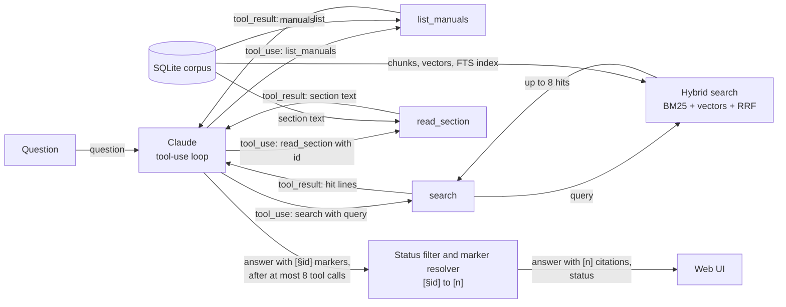
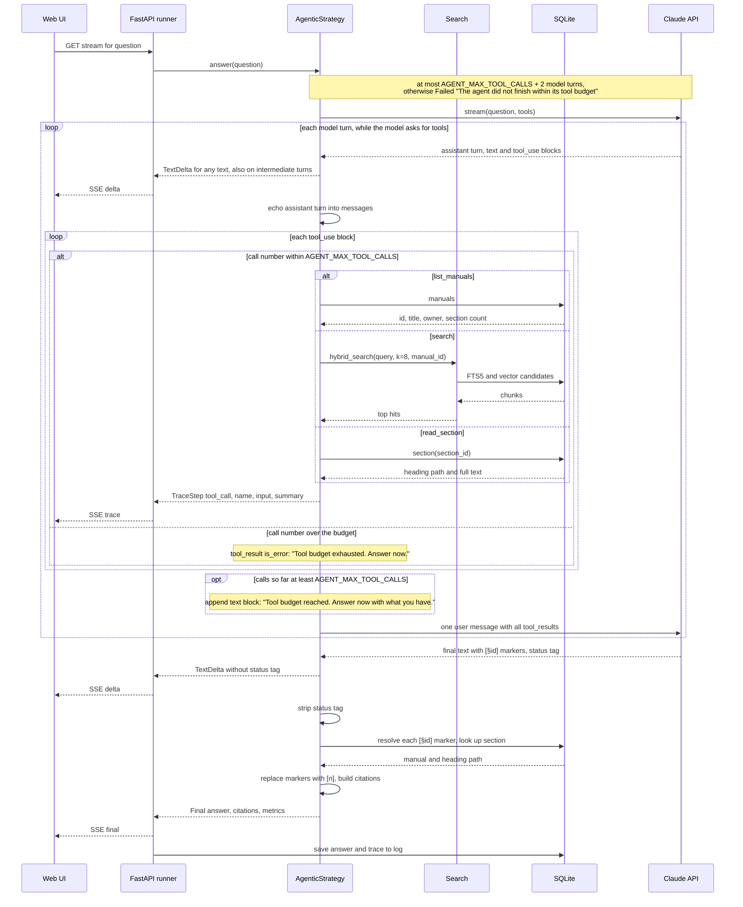

# Strategy 3: Agentic

The agentic strategy hands the research to the model. Instead of receiving content, Claude
receives tools to list, search and read the manuals, and decides for itself what to look at, how
many times, and when it knows enough. See the [architecture overview](../architecture/overview.md)
for how it fits into the app, and [choosing a strategy](../choosing-a-strategy.md) for a side-by-side
comparison.

## In one paragraph

**Tool use** is an API feature where you describe functions to the model (a name, a description
and a JSON schema for the arguments), and the model can answer with a request to call one instead
of with text. Your code runs the function and sends the result back, and the model continues. Doing
this in a loop turns a single model call into an **agent**: Claude starts with nothing but the
question, calls `list_manuals` to see what exists, `search` to find candidate sections (the same
hybrid search RAG uses), and `read_section` to read the ones that look promising. It can refine a
query, search one manual specifically, or read a neighbouring section, all based on what it has
learned so far. This makes it good at multi-step research across a big corpus, and every step is
visible in the trace. The costs are more model calls (one per turn), more tokens, more time, and
less predictable behaviour. The app caps the loop at 8 tool calls (`AGENT_MAX_TOOL_CALLS`).

## Diagrams

How data moves:

What happens in time order for one question:

## Step by step

1. **Start with the question and three tools.** `AgenticStrategy.answer`
   ([`answer`](../../uma/strategies/agentic.py)) sends only the question, the shared
   [`ANSWERING_RULES`](../../uma/strategies/rules.py) plus
   [`AGENTIC_ADDENDUM`](../../uma/strategies/rules.py) (which names the tools and the citation
   format), and the tool definitions in [`TOOLS`](../../uma/strategies/agentic.py). The tools use
   `strict: true`, so the model's arguments always match the schema. No content is sent up front.
2. **Stream each model turn.** Each turn is one streamed call
   ([`AnthropicLLM.stream`](../../uma/llm.py)). Any text the model writes, including remarks on
   intermediate turns such as "Let me check the hub guide", streams to the column, with the status
   tag hidden by [`StatusTagFilter`](../../uma/strategies/base.py).
3. **Run the requested tools.** When the turn ends with `stop_reason: "tool_use"`, the strategy runs
   each requested tool in [`_run_tool`](../../uma/strategies/agentic.py):
   - `list_manuals` returns one line per manual: id, title, owner, number of sections;
   - `search` calls [`hybrid_search`](../../uma/search.py) with `k=8` and an optional `manual_id`
     filter, and returns one line per hit: section id, manual, heading path and the first 300
     characters. There is no coverage rule here; the model decides whether to search other manuals;
   - `read_section` returns one section's heading path and full text.

   Each call emits a `tool_call` [`TraceStep`](../../uma/strategies/base.py) with the tool name, the
   input and the first line of the output. A bad argument or an unknown section id comes back to the
   model as an error result (`is_error`), so it can correct itself.
4. **Send the results back and loop.** The assistant turn and all tool results are appended to the
   conversation and the next turn starts. The whole conversation is re-sent every turn, so the
   prompt grows.
5. **Enforce the budget.** Calls are counted across turns. Once 8 calls have been made, a text
   notice "Tool budget reached. Answer now with what you have." is added to the tool results; any
   call beyond 8 is not run and returns "Tool budget exhausted. Answer now." If the model still has
   not answered after `AGENT_MAX_TOOL_CALLS + 2` turns, the strategy fails with "The agent did not
   finish within its tool budget".
6. **Resolve citations.** Tool results are plain text, not document blocks, so Claude's native
   citations can't point into them. Instead the addendum asks for markers like
   `[§nimbus-thermostat:settings:e3-heating-or-cooling-system-not-responding]`.
   [`resolve_section_markers`](../../uma/strategies/base.py) replaces each marker with `[n]` and
   builds the citation from the corpus store; a marker with an unknown section id is silently
   dropped ([ADR 0012](../adr/0012-citation-mechanism-per-strategy.md)).
7. **Report the result.** The `Final` event carries the last turn's text, the citations, the status
   and the metrics, including the number of tool calls.

## Prefer when

- **Large corpora where questions need multi-step research.** "Pair the thermostat with the hub"
  needs the hub's pairing mode, the thermostat's menu and the app's confirmation. An agent can find
  one, notice the reference to the others ("as described in the hub guide"), and go and read them.
- **A visible research trail is valuable.** The trace shows every search query and every section
  read. Support staff, auditors or learners can see *why* an answer says what it says.
- **The questions are varied and hard to anticipate.** A fixed retrieval pipeline is tuned for the
  questions you expected; an agent adapts its searches to the question in front of it.

## Avoid when

- **Latency-sensitive chat.** Every turn is a full model call, run one after another. Four or five
  turns take several times as long as a single call.
- **Strict cost ceilings.** The cost depends on how many turns the model takes, which you don't
  control. The budget caps the worst case; it doesn't make the cost predictable.
- **Simple lookups.** For "What does error E3 mean?" the agent often lists manuals, searches, reads
  the section and maybe reads a neighbour: three or four calls where RAG needed one. It
  over-researches.
- **Results must be the same for the same question.** The model may choose different queries on
  different runs and read different sections, so answers and costs vary from run to run.

## Cost and latency

Prices for the default model, Claude Sonnet 5.5, from
[ADR 0011](../adr/0011-switch-default-model-to-sonnet-5-5.md) and `PRICES` in
[`uma/config.py`](../../uma/config.py), in US dollars per million tokens (MTok):

| Input | Output | Cache read | Cache write |
|------:|-------:|-----------:|------------:|
| $2.00 | $10.00 | $0.20 | $2.50 |

**Worked example on the sample corpus.** These are illustrative assumptions, not measurements;
compare them with the footer when you run the demo. Assume a pairing question takes 5 model turns
with 6 tool calls (one `list_manuals`, two `search`, three `read_section`):

- system prompt, addendum and tool definitions: about 700 tokens, sent on every turn;
- each `search` result: 8 lines of up to about 330 characters, roughly 650 tokens;
- each `read_section` result: one sample section, roughly 150–250 tokens;
- each turn's output (thinking plus a tool request or the answer): about 300–500 tokens.

The conversation is re-sent each turn, so the prompt grows: roughly 750, 1,500, 2,300, 3,000 and
3,600 input tokens, about 11,000 input tokens across the five calls, plus about 2,000 output tokens.

| Part | Without caching | With caching (as sent) |
|------|----------------:|-----------------------:|
| Input | 11,000 × $2/MTok = $0.022 | ≈ 3,600 written × $2.50/MTok + ≈ 7,400 read × $0.20/MTok ≈ $0.010 |
| Output | 2,000 × $10/MTok = $0.020 | $0.020 |
| **Total** | **≈ $0.042** | **≈ $0.030** |

The "with caching" column applies because [`uma/llm.py`](../../uma/llm.py) sends a request-level
cache marker: each turn's prompt is the previous turn's prompt plus a little more, so most of it is
read back from the cache. (Very short prompts may be below the minimum cacheable length and billed
as plain input.) Either way, the agent is usually the most expensive column on a small corpus,
because every turn re-reads the conversation and produces output. On a large corpus it can be much
cheaper than whole-context, because it reads only what it chooses to.

Latency is the sum of the turns. If each turn takes a few seconds, five turns take 15–30 seconds,
well inside the 90-second `STRATEGY_TIMEOUT_S` but noticeably slower than the other columns.

**Reading the metrics footer.** Under each answer the app shows
`latency · input/output tok · cost · manuals used`. Token counts and cost are summed over all turns.
The input count shows only uncached input, so it can look small even after a long research loop;
the cost includes cache reads and writes. The number of tool calls is in the trace (one line per
call) and is saved with the answer's metrics.

## Typical failure modes

- **Stopping too early.** The model finds one relevant section, decides it knows enough and
  answers. For pairing, that can mean the thermostat steps without the hub's Link button. The trace
  shows it: look for a missing search in one of the manuals.
- **Budget exhaustion.** Broad questions ("a complete first-day setup checklist") can use all 8
  calls before the model has read everything it wanted. It is then told to answer with what it has,
  which may be incomplete. In the worst case it doesn't answer at all and the column shows "The agent
  did not finish within its tool budget".
- **Query loops.** The model repeats near-identical searches ("pair thermostat hub", "thermostat hub
  pairing", "hub pairing thermostat") that return the same hits, spending budget without learning
  anything new.
- **Citation slips.** Agentic citations are plain-text markers. A mistyped or invented section id is
  dropped silently, so a claim can lose its citation. The code checks only that a cited section
  exists, not that the model actually read it. And unlike the other two strategies, agentic
  citations carry no quoted passage (`cited_text` is empty).
- **Run-to-run variation.** The same question can produce a different trace, a different answer and
  a different cost the next time. Don't judge the strategy on a single run.

## What to look for in the demo

- **The trace as a story.** Read the `tool_call` lines in order: what did it search for first, which
  sections did it decide to read, did it change its query after a poor result? This is the clearest
  view of "the model driving retrieval" that the demo offers.
- **Narration that disappears.** Text the model writes on intermediate turns streams into the column
  and is replaced by the final, formatted answer when it arrives.
- **Cross-manual pairing.** For "How do I pair the thermostat with the hub?" check that it read
  sections from all three manuals, and compare its combined list with whole-context's.
- **Over-research on lookups.** For "What does error E3 mean?" count the tool calls and compare the
  cost and latency with RAG's.
- **Honest gaps.** For the Alexa question, watch it search, find nothing about voice assistants, and
  report `not_covered`. Unlike RAG, it may try several phrasings before concluding.
- **Budget on broad questions.** For the first-day setup checklist, see whether it hits the 8-call
  budget and how complete the answer is.

The full list of showcase questions is in [demo questions](../demo-questions.md).
