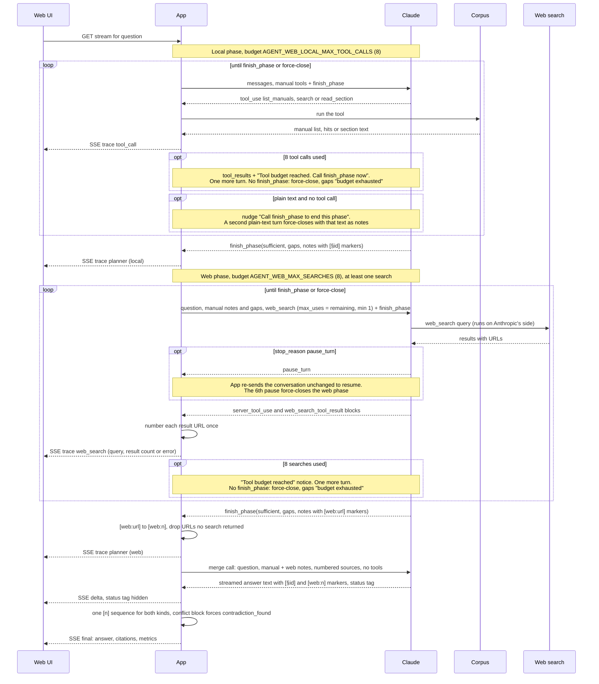

# Strategy 4: Agentic & web

The agentic & web strategy researches a question twice: first in the manuals, then on the web.
Then it writes one answer that cites both, and it points out where the web disagrees with a manual.
It is the [agentic strategy](3-agentic.md) with three additions: an explicit planner step that ends
each phase, a web search phase, and a separate merge call. It is also the only strategy that may
use sources other than the manuals, a deliberate exception recorded in
[ADR 0014](../adr/0014-agentic-web-strategy.md). See the
[architecture overview](../architecture/overview.md) for how it fits into the app, and
[choosing a strategy](../choosing-a-strategy.md) for a side-by-side comparison.

## In one paragraph

The strategy runs **three phases**, each its own conversation with Claude, orchestrated in Python.
In the **local phase** Claude gets the same three manual tools as Agentic (`list_manuals`, `search`,
`read_section`) plus a **planner tool**, `finish_phase(sufficient, gaps, notes)`, which it calls to
say "I'm done here": whether the manuals answer the question on their own, what is still missing,
and its findings with citation markers. In the **web phase** Claude gets the question, the local
notes and gaps, and Claude's **server-side web search tool**: Anthropic runs the searches, the app
only sees the results. It is told to fill the gaps *and* to check what the manuals claim, so it
always searches at least once, even when the manuals look complete, because an out-of-date manual
can only be caught by checking it. It ends with `finish_phase` too. The **merge call** has no tools:
it reads both sets of notes and writes the answer, citing manual sections and web pages in one
`[n]` numbering. When the manual and the web disagree, it writes a highlighted **conflict block**
instead of picking a winner. That makes the column useful beyond answering: it flags manuals that
may need updating. The price is the most tokens, the most time and a per-search fee, and the answer
no longer comes only from content you control.

## Diagrams

How data moves:

```mermaid
flowchart LR
    Q["Question"] -->|"question"| LP["Local phase<br/>list_manuals / search / read_section loop,<br/>at most 8 tool calls"]
    DB[("SQLite corpus")] -->|"manual list, hits, section text"| LP
    LP -->|"finish_phase: notes with [§id] markers"| FL{"Local planner<br/>sufficient? gaps"}
    LP -.->|"budget used and no finish_phase<br/>on the next turn"| FC1["Force-close local phase<br/>gaps: budget exhausted"]
    FC1 --> FL
    FL -->|"question + manual notes and gaps"| WP["Web phase<br/>web_search loop, at least one search,<br/>at most 8 searches"]
    WS["Web search<br/>Claude server tool"] -->|"results with URLs"| WP
    WP -->|"finish_phase: notes with [web:url] markers"| FW{"Web planner<br/>sufficient? gaps"}
    WP -.->|"budget used and no finish_phase<br/>on the next turn, or too many pause_turns"| FC2["Force-close web phase"]
    FC2 --> FW
    FW -->|"manual notes + web notes,<br/>numbered web sources"| MG["Merge call<br/>no tools"]
    MG -->|"streamed answer with [n] citations,<br/>⚠ conflict blocks, status"| UI["Web UI"]
```



What happens in time order for one question:



## Step by step

1. **Local phase: research the manuals.** `AgenticWebStrategy.answer`
   ([`agentic_web.py`](../../uma/strategies/agentic_web.py)) calls
   [`run_phase`](../../uma/strategies/phase.py) with the question, the system prompt
   [`AGENTIC_WEB_LOCAL`](../../uma/strategies/rules.py), the manual tools from
   [`manual_tools.py`](../../uma/strategies/manual_tools.py) (the same code Agentic uses) and
   [`FINISH_PHASE_TOOL`](../../uma/strategies/phase.py). The prompt says: research, don't answer;
   cite with `[§section_id]`; report what the manuals don't cover as gaps. Each tool call is a
   `tool_call` trace step, now tagged with `phase: "local"`. Nothing streams into the answer area
   during this phase.
2. **The planner ends the phase.** When Claude calls `finish_phase`, any other tools requested in
   the same turn run first, then the phase ends. The app emits a `planner` trace step: the phase,
   `sufficient`, the `gaps` and whether the close was `forced`. In the column it reads like
   `local planner: sufficient` or `local planner: insufficient (gaps: …)`.
3. **Budget and force-close.** The local budget is 8 tool calls
   (`AGENT_WEB_LOCAL_MAX_TOOL_CALLS`); `finish_phase` doesn't count. When the budget is used, the
   tool results are followed by "Tool budget reached. Call finish_phase now with what you have." and
   Claude gets one more turn. Tools it asks for in that turn are not run. If it still doesn't call
   `finish_phase`, the phase is **force-closed**: `sufficient=false`, `gaps=["budget exhausted"]`,
   and its last text becomes the notes. If Claude writes plain text without calling any tool, it is
   nudged once ("Call finish_phase to end this phase."); a second plain-text turn closes the phase
   with that text as the notes. Either way, the pipeline goes on to the next phase.
4. **Web phase: check and fill in on the web.** `run_phase` runs again with
   [`AGENTIC_WEB_SEARCH`](../../uma/strategies/rules.py), and a prompt made of the question plus
   the local notes and gaps. The tools are `finish_phase` and Claude's server-side web search,
   `{"type": "web_search_20260209", "name": "web_search", "max_uses": n}`. The prompt asks Claude to
   fill the gaps **and** to check the manuals' claims, especially versions, dates, settings and
   procedures that may have changed, and to say explicitly where the web disagrees. Each search
   arrives as a `server_tool_use` block followed by a `web_search_tool_result` block, and becomes a
   `web_search` trace step with the query and the number of results (or the error code).
5. **Web budget, at least one search, `pause_turn`.** The budget is 8 searches
   (`AGENT_WEB_MAX_SEARCHES`). Each request sets `max_uses` to the searches left, but at least 1, so
   the extra turn after the budget notice can run at most one search over the budget; the
   `web_searches` metric counts the searches actually made. Calling `finish_phase` before any search
   is refused with "Search the web at least once before finishing." Because the searches run on
   Anthropic's side, a long turn can come back with `stop_reason: "pause_turn"`. The app resumes it
   by sending the conversation back unchanged (no new user message), up to 5 times per phase; the
   6th pause closes the web phase straight away, because a nudge can't follow a search that is
   still unresolved. The budget notice and the nudge work as in the local phase.
6. **Web sources are numbered, and only real ones survive.** Every result URL is added once to a
   numbered list ([`WebSources`](../../uma/strategies/web_sources.py)). Claude cites web pages in
   its notes as `[web:<url>]`, because the URLs are already in its context. When the phase ends,
   each `[web:<url>]` becomes `[web:<n>]`, and a URL that no search returned is dropped with its
   marker. So the answer can only cite pages that were actually retrieved. If every search failed,
   the notes are replaced with "Web search was unavailable."
7. **Merge: one streamed answer.** The last call has no tools and the rules
   [`AGENTIC_WEB_MERGE_RULES`](../../uma/strategies/rules.py), which replace the shared
   `ANSWERING_RULES` for this strategy. Its input is the question, both phases' notes and gaps, and
   the numbered web source list. It answers from the manuals first and uses the web to fill gaps
   and to check them, cites every claim with `[§section_id]` or `[web:<n>]`, and ends with a status
   tag (ADR 0009). This is the only phase whose text streams into the column.
8. **Conflict blocks.** When manual and web disagree, the merge writes a Markdown block quote with
   a fixed prefix, citing both sides:

   ```markdown
   > ⚠ **Conflict: the manual may be out of date.** The manual says X [1]. The web says Y [2].
   ```

   The UI recognises the prefix and highlights the block. The status should be
   `contradiction_found`; if the model writes a conflict block but tags the answer `answered` (or
   forgets the tag, which defaults to `answered`), the strategy sets `contradiction_found` itself.
9. **Resolve citations and report.**
   [`resolve_mixed_markers`](../../uma/strategies/base.py) replaces `[§id]` and `[web:n]` markers in
   one pass with a single `[n]` sequence, so manual and web citations share one numbering. Unknown
   markers are removed. A web citation has `kind: "web"`, the page title and URL; in the column it
   opens the page in a new tab. The footer lists manuals and web hosts separately and shows the
   number of searches. Cost is the token cost of all three phases plus $0.01 per search.

Two edge cases differ from the other columns. If the web searches fail (the search tool reports an
error such as `unavailable` or `too_many_requests`), the column still answers from the manuals and
says that the web check could not be done. If the API rejects the request itself (for example
because web search is turned off for your organisation), the column fails with that error like any
other API error. And if the manuals have nothing on the question, the answer comes from the web
alone and says so; the strategy would do the same with an empty corpus, although the app refuses
questions until some manuals are ingested.

## Prefer when

- **Manuals may be out of date.** Firmware, apps and procedures change faster than documentation.
  This column checks the manual's claims against the web and shows a conflict block, with both
  sources cited, when they disagree.
- **Keeping documentation up to date.** Run your common questions through it and collect the
  `contradiction_found` answers: each conflict block names a manual section that may need a review.
- **Questions that reach beyond the manuals.** Compatibility with other products, known issues or
  newer features that the manuals don't mention can be filled in from the web, clearly cited as
  web sources and kept apart from manual citations.
- **A visible, two-sided research trail.** The trace shows every manual tool call, every web query
  and each planner's verdict on whether its phase was sufficient.

## Avoid when

- **Answers must come only from approved content.** Support, legal, medical or safety answers often
  must not quote random web pages. Web results are not reviewed by you, can be wrong, and can be
  about a different product with a similar name. Use a manuals-only strategy.
- **Cost or latency is tight.** It is the slowest and most expensive column: three phases, about ten
  model requests, $0.01 per search, and no answer text until the merge starts.
- **The network or web search is unavailable or not allowed.** Offline or air-gapped deployments,
  organisations that have turned off Claude's web search, or policies that forbid sending questions
  (and the manual findings that shape the queries) to a search engine.
- **Results must be the same for the same question.** Like Agentic it varies from run to run, and
  the web itself changes, so the same question can cite different pages tomorrow.

## Cost and latency

Prices for the default model, Claude Sonnet 5.5, from
[ADR 0011](../adr/0011-switch-default-model-to-sonnet-5-5.md) and `PRICES` in
[`uma/config.py`](../../uma/config.py), in US dollars per million tokens (MTok), plus the web search
fee (`WEB_SEARCH_USD_PER_SEARCH`):

| Input | Output | Cache read | Cache write | Web search |
|------:|-------:|-----------:|------------:|-----------:|
| $2.00 | $10.00 | $0.20 | $2.50 | $0.01 per search |

**Worked example on the sample corpus.** These are illustrative assumptions, not measurements;
compare them with the footer when you run the demo. Assume the local phase uses all 8 tool calls,
the web phase makes 3 searches, and then the merge runs.

- **Local phase, 6 requests.** One `list_manuals`, three `search` and four `read_section` calls
  over five turns (Claude often asks for two tools at once), which uses the budget; the sixth turn
  calls `finish_phase`. The first prompt (rules, four tool definitions, question) is about 950
  tokens, and it grows with each tool result: roughly 950, 1,300, 2,250, 3,900, 4,600 and 5,300
  tokens, about **18,300 input tokens**. Output (thinking, tool requests and the notes): about
  **2,200 tokens**.
- **Web phase, 3 searches.** The first prompt (rules, question, local notes and gaps, the two tool
  definitions) is about 1,800 tokens. Each search adds about 2,500 tokens of results, which are
  billed as input and read again at every later step: roughly 1,800, 4,500, 7,200 and 9,900 tokens,
  about **23,400 input tokens**. Output: about **1,500 tokens**.
- **Merge, 1 request.** Rules, question, both sets of notes and about 15 numbered sources: about
  **2,500 input tokens**. Output (answer plus thinking): about **900 tokens**.

In total about 44,200 input tokens, 4,600 output tokens and 3 searches:

| Part | Without caching | With caching (as sent) |
|------|----------------:|-----------------------:|
| Input | 44,200 × $2/MTok = $0.088 | ≈ 17,700 written × $2.50/MTok + ≈ 26,500 read × $0.20/MTok ≈ $0.050 |
| Output | 4,600 × $10/MTok = $0.046 | $0.046 |
| Web searches | 3 × $0.01 = $0.030 | $0.030 |
| **Total** | **≈ $0.164** | **≈ $0.126** |

The "with caching" column applies because [`uma/llm.py`](../../uma/llm.py) sends a request-level
cache marker. Within a phase, each request's prompt is the previous one plus a little more, so what
is written to the cache adds up to roughly the last prompt of each phase (5,300 + 9,900 + 2,500 =
17,700 tokens) and the rest is read back (18,300 + 23,400 + 2,500 − 17,700 = 26,500 tokens). The
merge is a single call, so caching only adds the write premium there. That is about four times
Agentic's worked example (about $0.03), and the three searches alone cost as much as a whole Agentic
answer. More searches cost twice: $0.01 each, plus the extra input tokens their results add to
every later step.

Latency is the sum of the phases, run one after another. With a few seconds per request, the local
phase takes about 20–30 seconds, the web phase 15–30 seconds and the merge 5–10 seconds: roughly
40–70 seconds, and the column shows only trace lines until the merge starts streaming. That is why
this strategy has its own timeout of 180 seconds (`AGENT_WEB_TIMEOUT_S`) instead of the 90-second
`STRATEGY_TIMEOUT_S` the other columns use.

**Reading the metrics footer.** The footer reads
`latency · input/output tok · cost · N web searches · Manuals: … · Web: hosts`. Token counts and
cost are summed over all three phases; the input count shows only uncached input, while the cost
includes cache reads and writes and the search fee.

## Typical failure modes

- **False conflicts.** Web results can be about a different product, model or region, or simply be
  wrong. The merge may then report a conflict that isn't one. Check what the web citation actually
  says before you change a manual. The sample Nimbus products are fictional, so on the sample
  corpus web results are about other products or thermostats in general.
- **Missed conflicts.** The web phase only checks what it searches for. If its queries don't touch
  the claim that has changed, or the planner decides early that the manuals are sufficient, the
  outdated claim passes unchecked.
- **Web answers dressed as manual answers.** The rules say to answer from the manuals first and to
  say when an answer comes only from the web. Check the citations: a `[n]` that opens a web page in
  a new tab is not from your manuals.
- **Dropped web citations.** A URL the model cites but no search returned is removed together with
  its marker, so a claim can lose its citation. This is deliberate: an invented URL is worse than
  none.
- **Budget and pause force-closes.** Broad questions can use all 8 local calls or all 8 searches.
  Look for `[forced]` and `gaps: budget exhausted` on a planner line: that phase was cut short, and
  the merge works with what it had.
- **Web search unavailable.** When searches return errors, the trace shows `web search: "…" → error
  …`, and the answer says the manuals could not be checked against the web. The answer is then no
  better than Agentic's, at a higher cost.
- **Timeout.** On a slow day three phases can exceed 180 seconds, and the column shows "Timed out".

## What to look for in the demo

- **The two planner lines.** `local planner: …` and `web planner: …` show each phase's own verdict:
  did the manuals suffice, what was missing, was the phase forced to close.
- **Web queries in the trace.** Compare them with the local gaps. Does the web phase check the
  manual's claims, or only fill the gaps?
- **Conflict blocks.** A highlighted `⚠ Conflict: the manual may be out of date.` block cites both a
  manual section and a web page, and the status badge shows `contradiction_found`. Open both
  citations and decide who is right.
- **Two kinds of citation in one list.** Manual citations open the section; web citations open the
  page in a new tab. The footer lists manuals and web hosts separately.
- **Agentic vs Agentic & web.** On the same question, compare the local phase with the Agentic
  column's trace, then see what the web phase adds and what it costs: the footer shows the number of
  searches and the total.
- **Planted contradiction, web edition.** For "How long do I hold the reset button to factory-reset
  the thermostat?" both manual sections should still be found and reported. The web can't settle a
  fictional product's reset time, so watch whether the answer correctly treats generic web results
  as unrelated.

The full list of showcase questions, including the conflict-detection ones, is in
[demo questions](../demo-questions.md#conflict-detection-with-agentic--web).
