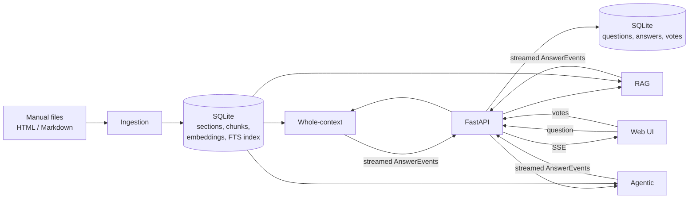

# UserManualAssistant v1 — Retrieval Strategy Comparison: Design

- **Date:** 2026-10-04
- **Status:** Approved 2026-10-04
- **Decisions:** see [`docs/adr/`](../../adr/)

## 1. Purpose

UserManualAssistant answers questions across a small set of user manuals. Version 1 is an
**educational demo**: the same question is answered by **three retrieval strategies side by side**,
so a learner can see how each one works, where it shines and where it fails, and rate the answers.

Success means:

1. **Cross-manual synthesis.** A question that spans manuals gets one coherent answer, with every
   step cited to the manual and section it came from.
2. **Honesty.** When the manuals do not cover a question, the answer says so. When two manuals
   contradict each other, the answer flags the contradiction and cites both sides.
3. **Understandability.** Each strategy's mechanism, information flow and trade-offs are documented
   well enough that a learner can explain when to choose it.

### Out of scope for v1

Author reports (gaps, inconsistencies, new use cases), consultation scheduling, user accounts,
PDF / Word / wiki ingestion, deployment beyond a local machine. v1 stores every question and answer
so the author-report features have data later.

## 2. Users and usage

- One person (the demo owner) or a few colleagues, running the app locally.
- A typical session: ~2 hours of asking questions and rating answers, then reading the leaderboard.
- Corpus: a few external manuals plus a few internal company manuals, all HTML or Markdown.
  Sending manual text to the Claude API is permitted. Internal manuals are never committed.

## 3. The three strategies

All three receive the same question, the same corpus, the same model and the same answering rules
([ADR 0006](../../adr/0006-same-model-and-rules-for-all-strategies.md)). They differ **only in how
they select the manual content Claude sees**.

| # | Strategy | How content is selected |
|---|----------|------------------------|
| 1 | **Whole-context** | Every section of every manual is sent on every question. Prompt caching makes repeat questions cheap. |
| 2 | **RAG** | Hybrid search (keyword + vector) picks the top chunks; only those are sent. |
| 3 | **Agentic** | Claude gets tools (`list_manuals`, `search`, `read_section`) and explores the corpus itself before answering. |

## 4. Architecture



### 4.1 Units

| Unit | Responsibility | Depends on |
|------|----------------|------------|
| `corpus.ingest` | Parse HTML / Markdown into sections; write corpus tables | parsers, `store` |
| `corpus.store` | Read/write sections, chunks, embeddings, FTS index | SQLite |
| `search` | Hybrid search (BM25 + vector, reciprocal rank fusion) over chunks | `corpus.store`, embedder |
| `llm` | Thin wrapper over the Anthropic SDK; one `FakeLLM` for tests | `anthropic` |
| `strategies.base` | `Strategy` protocol, `AnswerEvent` types, shared answering rules, status-tag parser | — |
| `strategies.whole_context` / `.rag` / `.agentic` | One strategy each | `base`, `llm`, `corpus.store`, `search` |
| `runner` | Run the three strategies in parallel, multiplex their events, persist the result | strategies, `log` |
| `log` | Questions, answers, metrics, votes | SQLite |
| `leaderboard` | Aggregations over votes | `log` |
| `web` | FastAPI routes, SSE, static files | everything above |
| `static/` | `index.html`, `leaderboard.html`, plain JS, CSS, mermaid.js | — |

### 4.2 Strategy interface

```python
class Strategy(Protocol):
    id: str            # "whole_context" | "rag" | "agentic"
    title: str         # human-readable name
    async def answer(self, question: str) -> AsyncIterator[AnswerEvent]: ...
```

`AnswerEvent` is one of:

- `TextDelta(text)` — a streamed piece of the answer (status tag stripped).
- `TraceStep(kind, detail)` — a visible research step (RAG: retrieved chunks; agentic: tool calls).
- `Final(answer: Answer)` — the complete result.
- `Failed(message, hint_doc?)` — the strategy could not answer; optional link to its docs.

```python
@dataclass
class Answer:
    text: str
    citations: list[Citation]   # manual_id, section_id, heading_path, anchor_url, cited_text
    status: Literal["answered", "not_covered", "contradiction_found"]
    metrics: Metrics            # latency_ms, input/output/cache tokens, cost_usd, manuals_used
```

## 5. Data flow

### 5.1 Ingestion

1. Each manual lives in `manuals/<manual-id>/` with a `manual.yaml`:
   `title`, `owner`, `visibility: internal|external`, `base_url` (for citation links).
   `sample_manuals/` holds the fictional sample corpus with the same layout.
2. The parser splits each document on headings. A **section** has `section_id`, `manual_id`,
   `heading_path` (e.g. `Setup › Network › Wi-Fi`), `anchor_url`, `text`. HTML pages are stripped of
   navigation, headers, footers and scripts.
3. **Chunks** for RAG: one chunk per section; sections over ~400 tokens are split at paragraph
   boundaries with a small overlap. Each chunk keeps its `section_id`.
4. Embeddings are computed locally ([ADR 0008](../../adr/0008-local-embeddings-and-fts5-for-rag.md))
   and stored as blobs; chunks are also inserted into an FTS5 table.
5. The whole-context token count is measured with the token-counting endpoint on the first whole-context question and stored, so `ingest` needs no API credentials.

Command: `python -m uma ingest [--manuals-dir manuals]`. Re-running replaces the corpus.

### 5.2 Asking a question

1. `POST /api/questions {text}` → `{question_id}`; the UI then opens
   `GET /api/questions/{id}/stream` (SSE, [ADR 0004](../../adr/0004-server-sent-events-for-streaming.md)).
2. `runner` starts the three strategies concurrently. Every SSE event carries the strategy id.
3. **Whole-context:** each manual is a `document` block whose content is the list of its sections
   (one content block per section), `citations: {enabled: true}`, with a cache breakpoint after
   the last document. Citations come back as `content_block_location`, which maps directly to a
   section. If the stored token count exceeds `WHOLE_CONTEXT_MAX_TOKENS` (default 800 000), the
   strategy emits `Failed("Corpus is N tokens, too large for whole-context", hint_doc=...)`.
4. **RAG:** hybrid search returns the top 8 chunks, then guarantees at least one chunk from every
   manual whose best chunk scores ≥ 50% of the top score (so cross-manual answers are possible).
   Retrieved chunks are emitted as a `TraceStep`, then sent as `document` blocks with citations.
5. **Agentic:** tools `list_manuals()`, `search(query, manual_id?)` (the same hybrid search as RAG,
   so the loop is the only variable), `read_section(section_id)`. Manual tool-use loop, at most
   8 tool calls; on the cap the model is told to answer with what it has. Each tool call is
   emitted as a `TraceStep`. The final answer cites section ids, which are mapped to anchors.
6. Each strategy streams `TextDelta`s and ends with `Final` or `Failed`. Per-strategy timeout: 90 s.
7. `runner` writes the question, the three answers and their metrics to the log.

### 5.3 Answer status

The shared answering rules require the answer to end with exactly one tag:
`<status>answered</status>`, `<status>not_covered</status>` or `<status>contradiction_found</status>`
([ADR 0009](../../adr/0009-answer-status-tag-protocol.md)). The streaming parser hides the tag from the
displayed text. A missing or malformed tag yields `answered` and a logged warning.

## 6. Web UI

### 6.1 Ask page (`/`)

- Question box; three columns, one per strategy, filling in parallel.
- Each column: answer text (Markdown rendered with marked, sanitised with DOMPurify) with inline citation markers `[n]` → a side panel showing the cited section, with an "Open original" link when the manual has a `base_url`; status
  badge; metrics footer (time, tokens, cost, manuals used); collapsible **research trace**;
  **How it works** button (opens the strategy's Mermaid diagram); **1–5 star rating**.
- **Mode toggle** (remembered in `localStorage`):
  - **Labelled (default):** fixed order Whole-context · RAG · Agentic, names visible.
  - **Blind:** order shuffled per question, columns labelled Answer X / Y / Z; names revealed after
    the column is rated or on clicking **Reveal**.
- Ratings can be changed until the next question is asked. Columns that failed cannot be rated.

### 6.2 Leaderboard (`/leaderboard`)

- Filter: all votes / blind only / labelled only.
- One row per strategy, ranked by average stars: rank, strategy, avg ★, votes, ★ distribution,
  wins (questions where it had the highest rating; ties count for all tied), avg latency,
  avg cost, not-covered rate, error count.
- Recent questions with their three ratings, sorted by largest rating spread first.
- **Export CSV** (one row per vote with question text and metrics) and **Reset statistics**
  (confirmation required; deletes votes, keeps the corpus).

## 7. Storage

One SQLite file, `data/uma.db` ([ADR 0005](../../adr/0005-sqlite-for-corpus-log-and-votes.md)).

| Table | Key columns |
|-------|-------------|
| `manuals` | id, title, owner, visibility, base_url, token_count |
| `sections` | id, manual_id, heading_path, anchor_url, text, position |
| `chunks` | id, section_id, text, embedding (blob) |
| `chunks_fts` | FTS5 over chunks.text |
| `questions` | id, text, asked_at, blind |
| `answers` | question_id, strategy, status, text, citations_json, trace_json, error, latency_ms, input_tokens, output_tokens, cache_read_tokens, cache_write_tokens, cost_usd |
| `votes` | question_id, strategy, stars (1–5), blind, voted_at — unique (question_id, strategy) |

## 8. Error handling

- Strategies are isolated: an exception in one becomes a `Failed` event for that column only.
- SDK retries handle 429 / 5xx / connection errors (default 2 retries); after that, `Failed`.
- Refusals (`stop_reason == "refusal"`) become `Failed("The model declined this question")`.
- Missing API credentials: the app starts, and each column explains how to set `ANTHROPIC_API_KEY`.
- Empty corpus: the ask page shows "Run `python -m uma ingest` first".
- Failed answers are excluded from star averages and counted in the leaderboard's error column.

## 9. Testing

Test-first throughout.

- **Unit:** Markdown and HTML parsing (heading paths, anchors, boilerplate stripping); chunking;
  hybrid search ranking and the per-manual guarantee; citation → anchor mapping; status-tag
  parsing including tags split across stream deltas; cost calculation; leaderboard maths
  (averages, wins with ties, blind filter); vote upsert.
- **Strategy tests** with `FakeLLM`, which replays scripted responses (text, citations, tool calls).
- **API tests** with FastAPI's test client, including the SSE stream.
- **Live smoke test** (opt-in, `pytest -m live`): one real question through all three strategies
  on the sample corpus.

## 10. Documentation (first-class deliverable)

```
docs/
├── adr/                         # one decision per file (MADR)
├── architecture/overview.md     # system diagram, component responsibilities, data flow
├── strategies/
│   ├── 1-whole-context.md
│   ├── 2-rag.md
│   └── 3-agentic.md
└── choosing-a-strategy.md       # decision matrix across the three
```

Every strategy explainer follows the same template:

1. **In one paragraph** — plain-language explanation.
2. **Diagrams** (Mermaid) — a component flowchart of where information travels, and a sequence
   diagram of one question end to end.
3. **Step by step** — each step linked to the code that implements it.
4. **Prefer when / avoid when** — with concrete thresholds.
5. **Cost and latency profile**, **typical failure modes**.
6. **What to look for in the demo** — sample-corpus questions that expose its strengths and weaknesses.

The same Mermaid sources are rendered in the app's **How it works** panel.

## 11. Sample corpus

`sample_manuals/` contains three short fictional manuals for one product family (for example a
smart thermostat, its mobile app and its home hub), written with:

- **overlap** — a task that needs steps from two manuals (pairing the thermostat through the hub);
- **a gap** — an obvious question none of them answers;
- **a contradiction** — two manuals disagree on a fact (for example the reset button hold time).

`docs/strategies/*` and the demo guide reference these planted cases.

## 12. Configuration

Environment variables (with `.env` support): `ANTHROPIC_API_KEY`, `UMA_MODEL` (default
`claude-sonnet-5-5`, [ADR 0011](../../adr/0011-switch-default-model-to-sonnet-5-5.md)), `UMA_EFFORT` (default
`medium`), `UMA_DB_PATH`, `UMA_MANUALS_DIR`, `WHOLE_CONTEXT_MAX_TOKENS`, `RAG_TOP_K`,
`AGENT_MAX_TOOL_CALLS`, `STRATEGY_TIMEOUT_S`. Model prices live in one table in `config.py`.

## 13. Repository layout

```
uma/                       # Python package
  __main__.py              # CLI: ingest, serve
  config.py
  corpus/{models,parse_markdown,parse_html,ingest,store}.py
  search.py
  llm.py
  strategies/{base,rules,whole_context,rag,agentic}.py
  runner.py
  log.py
  leaderboard.py
  web.py
  static/{index.html,leaderboard.html,app.js,leaderboard.js,style.css}
  static/diagrams/*.mmd    # Mermaid sources shared by docs and the app (ADR 0010)
sample_manuals/
manuals/                   # git-ignored: your real manuals
data/                      # git-ignored: SQLite database
tests/
docs/
```
